# 🎛️ ByteBoard

> A custom RGB macropad powered by the Seeed Studio XIAO RP2040.

**Author:** Jishnu Dutta
**Started:** 19 June 2026
**Progress:** 🟩🟩🟩🟩🟩🟩⬜⬜⬜⬜ 60%
**Current Stage:** Case final touches

---

## 📖 Overview

ByteBoard is a custom macropad built around the Seeed Studio XIAO RP2040. It features 9 mechanical keys, SK6812 MINI-E RGB LEDs, a rotary encoder, and an OLED display for customizable controls and visual feedback. The goal of this project is to create a compact and visually appealing productivity tool while learning PCB design, electronics, and firmware development.

---

## 📅 Devlogs

# Day 0 — 19.06.2026: Planning & Studying

Just a few days ago, my friend Sunrit Hazra showed me his custom macropad, which he had built using Hack Club Blueprint. Seeing his project and hearing about the experience inspired me to build one of my own.

Today, I decided to start the project, so I learned the basics of PCB design and schematic creation. I also made a small PCB with 4 LEDs and 2 connectors.

Time spent: 3hrs

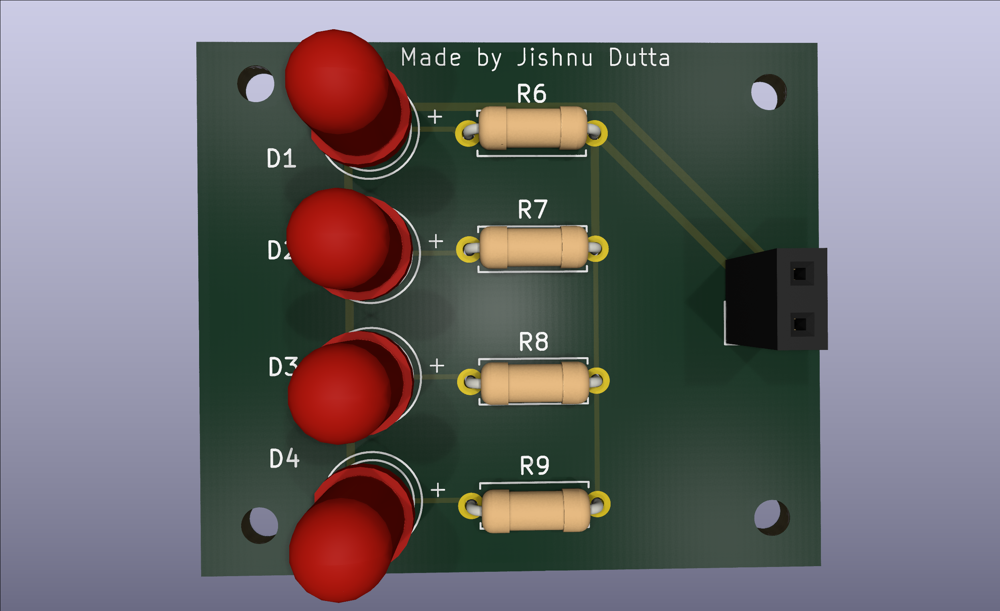

# Day 1 — 20.06.2026: Schematic

I created the 3×3 key matrix and connected it to the Seeed Studio XIAO RP2040. I also added the rotary encoder and OLED display.

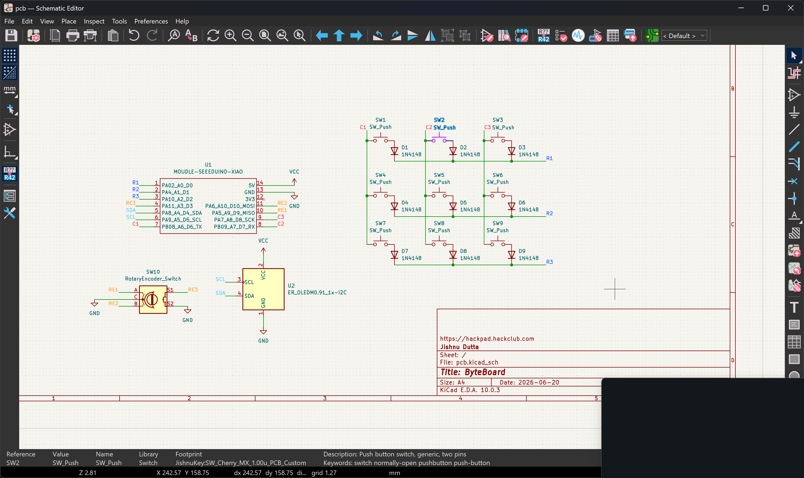

Time spent: 5hrs

# Day 2 — 21.06.2026: Schematic and Routing

I added SK6812 MINI-E LEDs around the edges of each key for a nice underglow effect, along with mounting holes. After that, I designed the PCB and completed the routing.

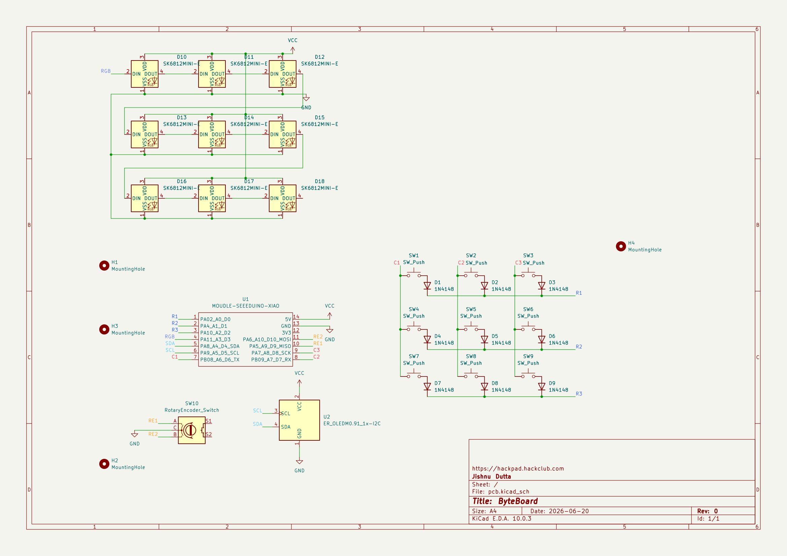
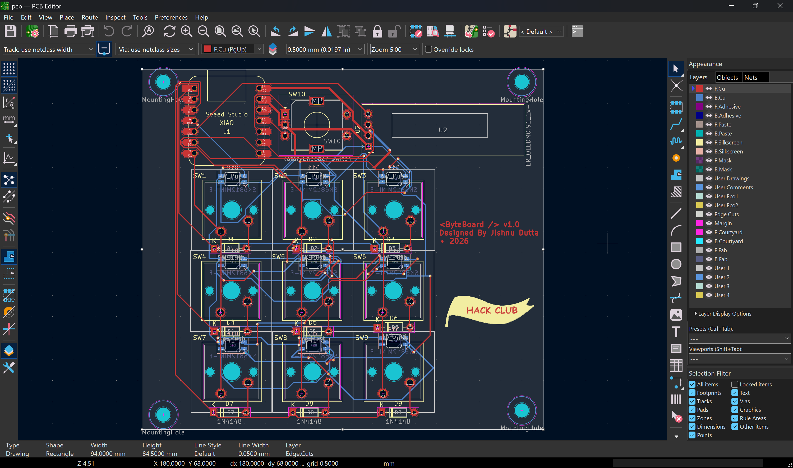
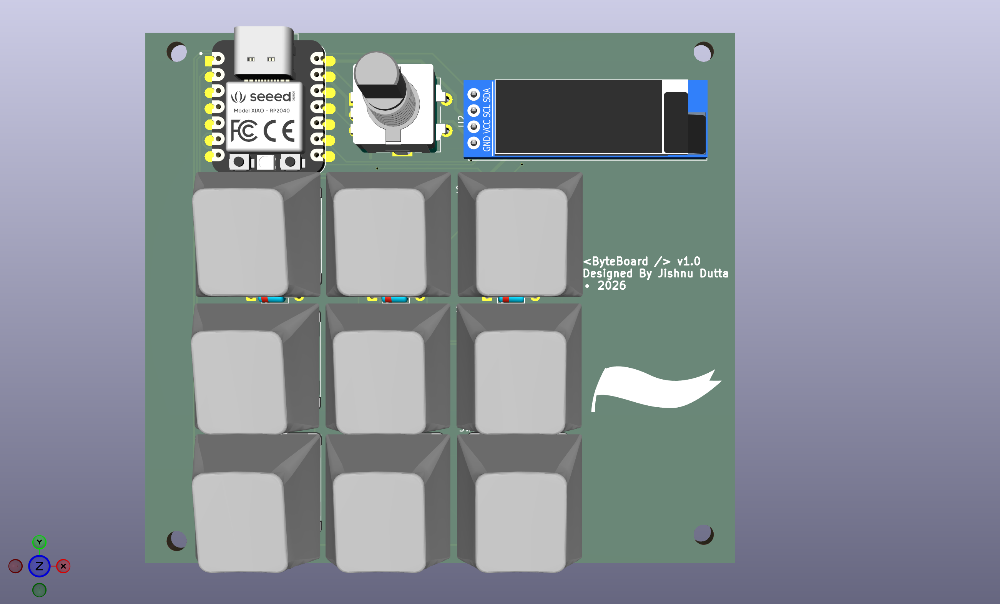

Time spent: 8hrs

# Day 3 — 22.06.2026: Learning Fusion

I learned the basics of 3D modeling in Autodesk Fusion by following a tutorial and creating a small screw bracket.

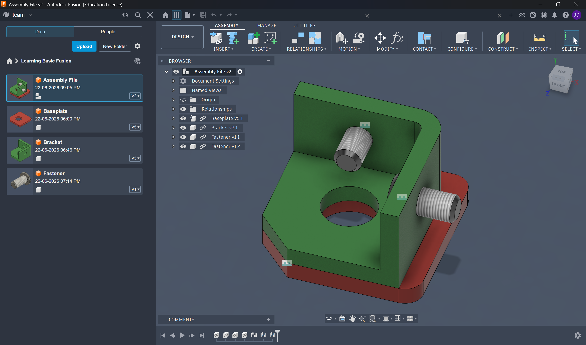

Time spent: 2hrs

Sorry for not recording timelapses during the first three days. I will provide timelapse links for every day from now on.

# Day 4 — 23.06.2026: Starting the Case and Learning Fusion Tools

I researched the soldering equipment I might need for this project and started designing the bottom plate of the case. 

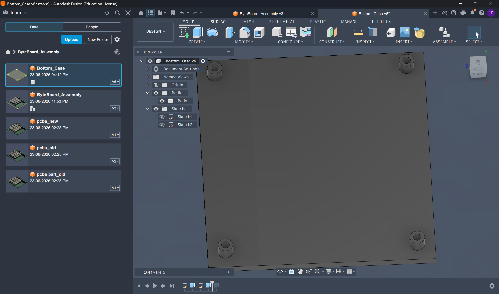

Time spent: 7hrs

Lapse link: <a href="https://lapse.hackclub.com/timelapse/p2R1_J-4u7W7">Day 4</a>

# Day 5 — 25.06.2026: Fixing the Case 
I fixed the standoffs, added walls in the bottom part of the case. I also had to fix many clearance issues to make the usb type c port usable.

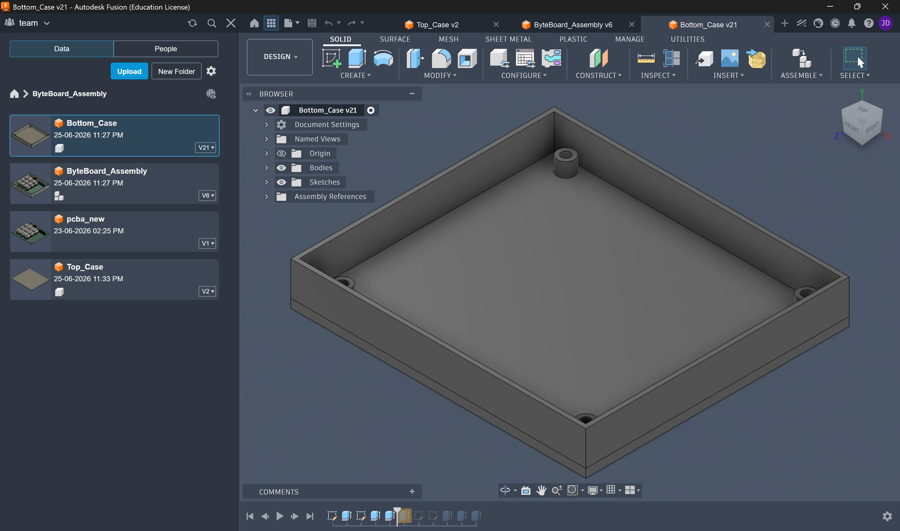

Time spent: 3 hrs

Lapse link: <a href="https://lapse.hackclub.com/timelapse/Zt0mHt_HGtjv">Day 5</a>

# Day 6 — 26.06.2026: Designing the Top Case

Today I finished designing the top case. I added all the required cutouts, including the MX switch openings, OLED display window, rotary encoder hole, USB Type-C port opening, and the mounting holes. Getting the clearances right took quite a bit of tweaking, especially around the USB port.

> **Note:** The Lapse website was offline for most of the day, so I could only record about **30 minutes**, even though I worked for **around 3 hours**.

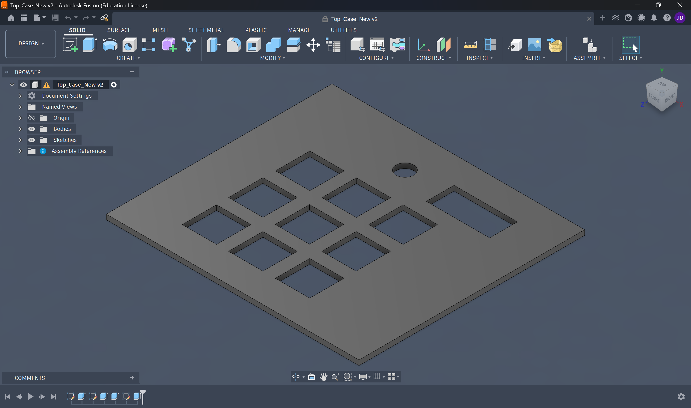
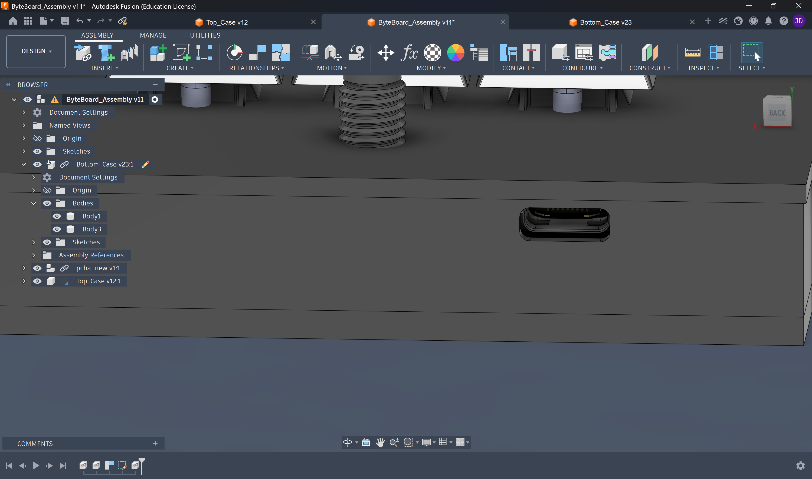

**Time spent:** 3 hrs

**Lapse link:** <a href="https://lapse.hackclub.com/timelapse/NO5s9hQjbQ5v">Day 6</a>
(Only ~30 minutes recorded due to Lapse downtime.)

---

# Day 7 — 27.06.2026: Heat-Set Inserts & Final Touches

Today I redesigned the mounting system to support **M3 × 5 × 4 mm heat-set inserts**. I updated all the standoffs, added chamfers to make inserting the brass inserts easier, and created counterbores for the screw heads. I also started refining the overall appearance by rounding the outer corners of the top case.

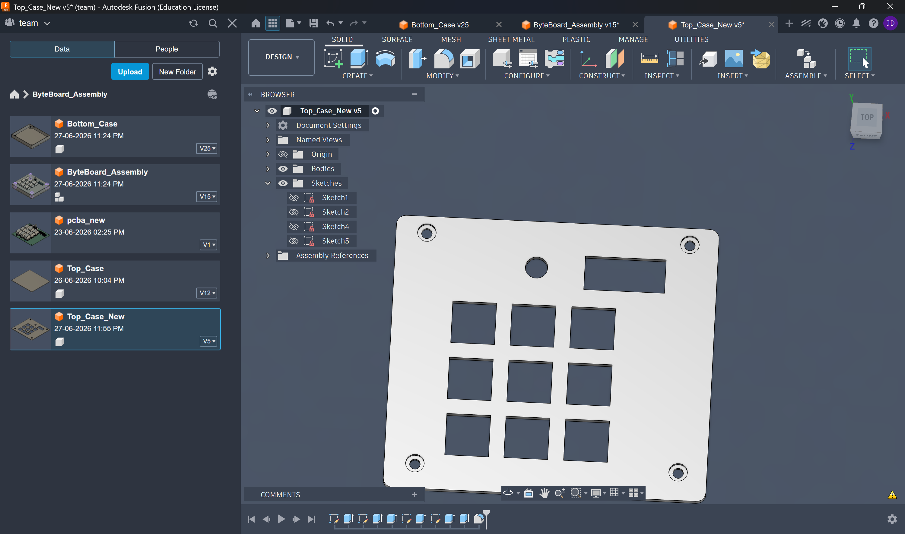

**Time spent:** 2 hrs

**Lapse link:** <a href="https://lapse.hackclub.com/timelapse/U-9jxX9-YpG4">Day 7</a>

# Day 8 — 28.06.2026: Heat-Set Inserts & Final Touches

Today I added colors to the case, added rounded corners and finalized the case design. Then I learned circuit python and wrote the temporary firmware.
I also shipped the project.

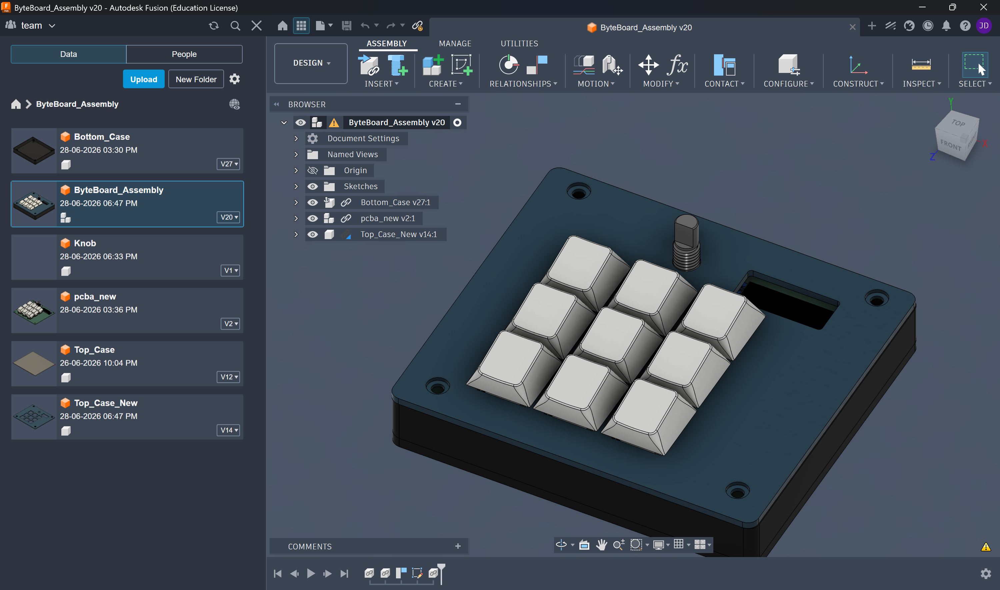

**Time spent:** 4.5 hrs

**Lapse link:** <a href="https://lapse.hackclub.com/timelapse/_NHgY39VfMSt">Day 8</a>

